# Agent App Linux Mission 수행내역서

## 1. 실행 환경

- OS: Ubuntu 22.04.5 LTS
- Kernel: Linux 6.6.87.2-microsoft-standard-WSL2
- Architecture: x86_64
- 사용한 Agent App 파일: `agent-app-linux-x86`
- AGENT_HOME: `/home/agent-admin/agent-app`

### 검증 명령

```bash
lsb_release -a
uname -a
uname -m
```

### 검증 결과

Ubuntu 22.04.5 LTS 환경이며, 아키텍처가 `x86_64`이므로 x86용 Agent 바이너리를 사용했다.

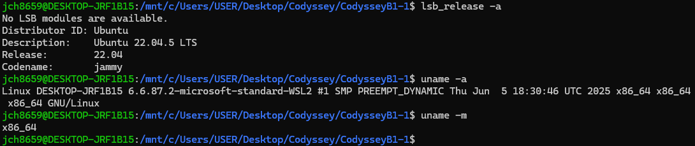

캡처 설명: Ubuntu 배포판 버전, WSL2 커널 정보, 시스템 아키텍처 `x86_64`를 확인한 화면이다.

## 2. SSH 설정

### 설정 내용

- SSH Port: `20022`
- PermitRootLogin: `no`

### 검증 명령

```bash
sudo sshd -t
sudo service ssh restart
sudo sshd -T | grep -E '^(port|permitrootlogin)'
ss -tulnp | grep ssh
```

### 검증 결과

```text
port 20022
permitrootlogin no
```

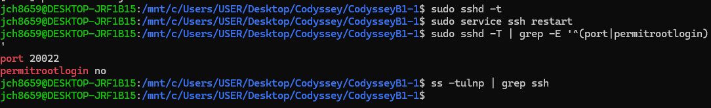

캡처 설명: SSH 설정 문법 검사를 통과한 뒤, `sshd -T`로 SSH 포트가 `20022`이고 root 원격 로그인이 비활성화된 것을 확인한 화면이다.

## 3. 방화벽 설정

### 선택 도구

- UFW

### 허용 포트

- `20022/tcp`
- `15034/tcp`

### 검증 명령

```bash
bash scripts/setup_firewall_ufw.sh
sudo ufw status verbose
```

### 검증 결과

UFW가 활성화되었고, 기본 incoming 정책은 deny, outgoing 정책은 allow로 설정되었다. SSH 포트 `20022/tcp`와 Agent 포트 `15034/tcp`가 IPv4, IPv6 모두에서 허용되었다.

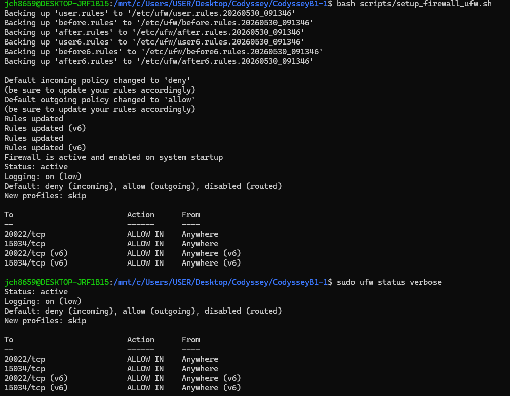

캡처 설명: UFW 초기화, 기본 정책 설정, `20022/tcp` 및 `15034/tcp` 허용, UFW 활성화 상태를 확인한 화면이다.

## 4. 계정 및 그룹 생성

### 생성 계정

- `agent-admin`
- `agent-dev`
- `agent-test`

### 생성 그룹

- `agent-common`
- `agent-core`

### 검증 명령

```bash
id agent-admin
id agent-dev
id agent-test
```

### 검증 결과

`agent-admin`, `agent-dev`, `agent-test` 계정이 생성되었다. `agent-admin`과 `agent-dev`는 `agent-common`, `agent-core` 그룹에 포함되며, `agent-test`는 `agent-common` 그룹에 포함된다.

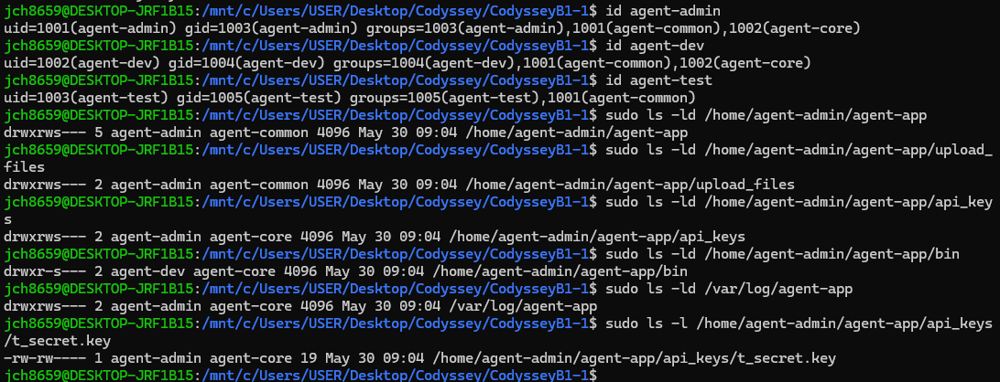

캡처 설명: 세 계정의 UID/GID 및 그룹 멤버십을 확인하고, 주요 디렉터리와 키 파일 권한을 함께 확인한 화면이다.

## 5. 디렉터리 및 권한

### 디렉터리 구조

```text
/home/agent-admin/agent-app
/home/agent-admin/agent-app/upload_files
/home/agent-admin/agent-app/api_keys
/home/agent-admin/agent-app/bin
/var/log/agent-app
```

### 검증 명령

```bash
sudo ls -ld /home/agent-admin/agent-app
sudo ls -ld /home/agent-admin/agent-app/upload_files
sudo ls -ld /home/agent-admin/agent-app/api_keys
sudo ls -ld /home/agent-admin/agent-app/bin
sudo ls -ld /var/log/agent-app
sudo ls -l /home/agent-admin/agent-app/api_keys/t_secret.key
```

### 검증 결과

`agent-app`와 `upload_files`는 `agent-common` 그룹 기준으로 접근 가능하게 구성했고, `api_keys`, `bin`, `/var/log/agent-app`는 `agent-core` 그룹 기준으로 제한했다. 키 파일은 group write 가능한 `660` 권한으로 생성했다.


캡처 설명: `/home/agent-admin/agent-app`, `upload_files`, `api_keys`, `bin`, `/var/log/agent-app`, 키 파일 권한을 확인한 화면이다.

## 6. Agent 앱 설치 및 실행

### 설치 검증 명령

```bash
bash scripts/install_agent_app.sh
sudo ls -l /home/agent-admin/agent-app/bin/agent-app
cat /etc/profile.d/agent-app.sh
```

### 설치 검증 결과

Agent 앱 바이너리가 `/home/agent-admin/agent-app/bin/agent-app` 위치에 설치되었고, owner/group은 `agent-dev:agent-core`, 권한은 `750`으로 설정되었다. 실행에 필요한 환경 변수도 `/etc/profile.d/agent-app.sh`에 등록되었다.

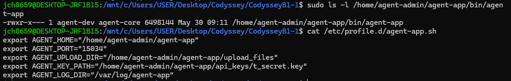

캡처 설명: Agent 바이너리 설치 위치, 소유자/그룹/권한, 환경 변수 설정 파일 내용을 확인한 화면이다.

### 실행 명령

```bash
sudo -iu agent-admin
source /etc/profile.d/agent-app.sh
export AGENT_KEY_PATH=/home/agent-admin/agent-app/api_keys
/home/agent-admin/agent-app/bin/agent-app
```

### 실행 결과

```text
All Boot Checks Passed!
Agent READY
Agent listening at port 15034
```

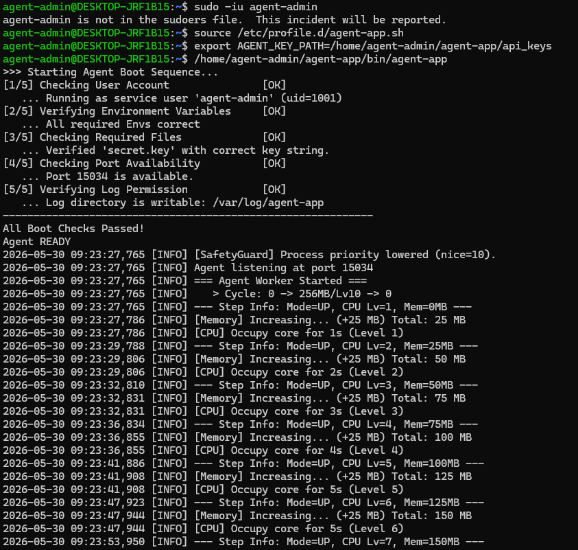

캡처 설명: Agent 앱 Boot Sequence 5단계가 모두 `[OK]`로 통과하고, `Agent READY` 및 `Agent listening at port 15034` 상태가 된 화면이다.

### 포트 확인

```bash
ss -tulnp | grep 15034
pgrep -af agent-app
```

### 포트 확인 결과

Agent 앱이 `0.0.0.0:15034`에서 LISTEN 중이며, `agent-app` 프로세스가 실행 중임을 확인했다.

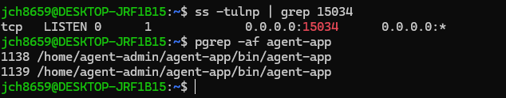

캡처 설명: `15034` 포트 LISTEN 상태와 실행 중인 `agent-app` 프로세스를 확인한 화면이다.

## 7. monitor.sh 구현 및 설치

### 파일 위치

```text
/home/agent-admin/agent-app/bin/monitor.sh
```

### 설치 명령

```bash
sudo cp scripts/monitor.sh /home/agent-admin/agent-app/bin/monitor.sh
sudo chown agent-dev:agent-core /home/agent-admin/agent-app/bin/monitor.sh
sudo chmod 750 /home/agent-admin/agent-app/bin/monitor.sh
sudo ls -l /home/agent-admin/agent-app/bin/monitor.sh
```

### 검증 결과

`monitor.sh`가 지정 위치에 설치되었고, owner/group은 `agent-dev:agent-core`, 권한은 `750`으로 설정되었다.

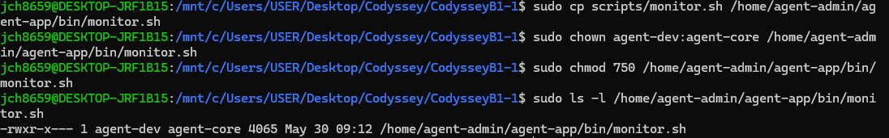

캡처 설명: `monitor.sh` 복사, 소유자/그룹 변경, 권한 변경, 최종 파일 권한 확인을 수행한 화면이다.

## 8. monitor.sh 수동 실행 및 로그 확인

### 수동 실행 명령

```bash
sudo -iu agent-admin /home/agent-admin/agent-app/bin/monitor.sh
```

### 로그 확인 명령

```bash
sudo tail -n 10 /var/log/agent-app/monitor.log
```

### 실행 결과

프로세스, 포트, 방화벽 상태가 모두 `[OK]`로 확인되었고, CPU/MEM/DISK 사용량이 출력되었다. 실행 결과는 `/var/log/agent-app/monitor.log`에 누적 기록되었다.

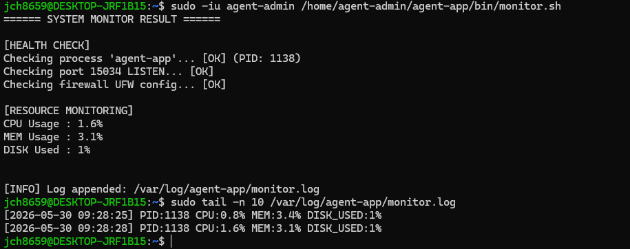

캡처 설명: `monitor.sh` 수동 실행 결과와 `monitor.log`에 기록된 누적 로그를 확인한 화면이다.

## 9. cron 매분 자동 실행 등록

### 등록 명령

```bash
sudo bash scripts/install_cron.sh
sudo -u agent-admin crontab -l
```

### 자동 실행 확인 명령

```bash
sleep 70
sudo tail -n 5 /var/log/agent-app/monitor.log
```

### 검증 결과

`agent-admin` 계정의 crontab에 다음 항목이 등록되었다.

```text
* * * * * /home/agent-admin/agent-app/bin/monitor.sh >> /var/log/agent-app/monitor_cron.out 2>&1
```

70초 대기 후 `monitor.log`에 새 로그가 추가되어 매분 자동 실행이 동작함을 확인했다.

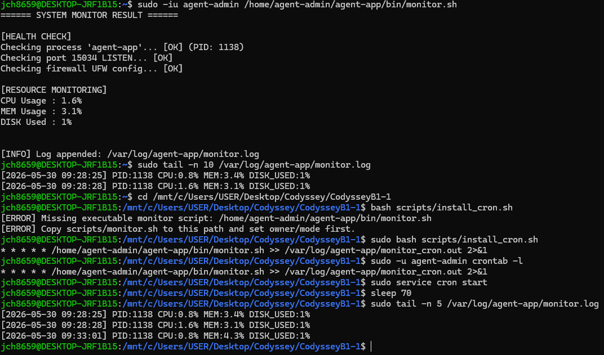

캡처 설명: crontab 매분 실행 등록, cron 서비스 시작, 70초 후 `monitor.log`에 새 로그가 추가된 것을 확인한 화면이다.

## 10. 전체 검증

### 검증 명령

```bash
sudo bash scripts/verify_all.sh
```

### 검증 결과

전체 검증에서 다음 항목을 확인했다.

- UFW 활성화 및 `20022/tcp`, `15034/tcp` 허용
- 계정 및 그룹 생성
- 주요 디렉터리 권한 설정
- `agent-app`, `monitor.sh`, 키 파일, 로그 파일 존재 및 권한 확인
- Agent 프로세스 실행 및 `15034` 포트 LISTEN
- `monitor.log` 누적 기록
- cron 매분 실행 등록

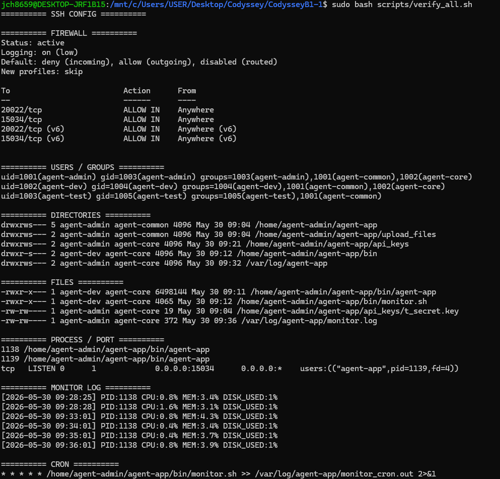

캡처 설명: `verify_all.sh`를 통해 방화벽, 계정/그룹, 디렉터리/파일 권한, 프로세스/포트, 로그, cron 등록 상태를 한 번에 확인한 화면이다.

## 11. 특이 사항

제공된 Agent 바이너리는 실행 시 키 파일 디렉터리 경로를 `AGENT_KEY_PATH=/home/agent-admin/agent-app/api_keys`로 기대했고, 키 파일 이름은 `secret.key`를 요구했다. 따라서 실행 검증 시 `t_secret.key`의 내용을 기준으로 `secret.key`를 추가 생성하고, `AGENT_KEY_PATH`를 키 디렉터리로 지정하여 실행했다.

## 12. 결론

이번 미션에서는 Ubuntu Linux 환경에서 SSH 보안 설정, UFW 방화벽 설정, 계정/그룹/권한 분리, Agent 앱 설치 및 실행, Bash 기반 `monitor.sh` 구현, 로그 누적 기록, cron 매분 자동 실행 등록을 수행했다. 최종 검증 결과 Agent 앱은 일반 계정 `agent-admin`으로 실행되었고, `monitor.sh`는 프로세스와 포트 상태를 확인한 뒤 `/var/log/agent-app/monitor.log`에 정상적으로 로그를 기록했다.
